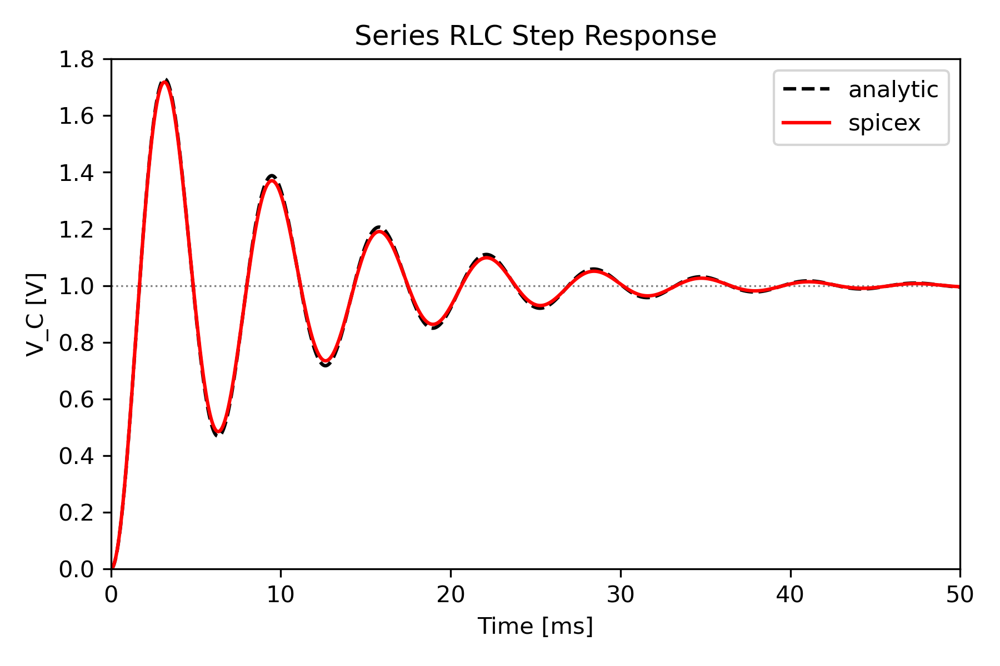

Examples
========

The `examples/ <https://github.com/SpiceXProject/spicex/tree/main/examples>`_ directory contains
a collection of scripts demonstrating various applications of spicex.

current_source_with_resistor
----------------------------

See on GitHub: `examples/current_source_with_resistor <https://github.com/SpiceXProject/spicex/tree/main/examples/current_source_with_resistor>`_

README:

.. literalinclude:: ../../examples/current_source_with_resistor/README.md
   :language: md

Script:

.. literalinclude:: ../../examples/current_source_with_resistor/current_source_with_resistor.py
   :language: python

maximum_power_transfer
----------------------

See on GitHub: `examples/maximum_power_transfer <https://github.com/SpiceXProject/spicex/tree/main/examples/maximum_power_transfer>`_

README:

.. literalinclude:: ../../examples/maximum_power_transfer/README.md
   :language: md

Script:

.. literalinclude:: ../../examples/maximum_power_transfer/maximum_power_transfer.py
   :language: python

pfn_type_b
----------

See on GitHub: `examples/pfn_type_b <https://github.com/SpiceXProject/spicex/tree/main/examples/pfn_type_b>`_

README:

.. literalinclude:: ../../examples/pfn_type_b/README.md
   :language: md

Script:

.. literalinclude:: ../../examples/pfn_type_b/pfn_type_b.py
   :language: python

Script:

.. literalinclude:: ../../examples/pfn_type_b/pfn_type_b.py
   :language: python

.. figure:: ../../examples/pfn_type_b/pfn_type_b.png
  :width: 480px
  :align: center
  :alt: pfn_type_b

resistors_in_parallel
---------------------

See on GitHub: `examples/resistors_in_parallel <https://github.com/SpiceXProject/spicex/tree/main/examples/resistors_in_parallel>`_

README:

.. literalinclude:: ../../examples/resistors_in_parallel/README.md
   :language: md

Script:

.. literalinclude:: ../../examples/resistors_in_parallel/resistors_in_parallel.py
   :language: python

resistors_in_series
-------------------

See on GitHub: `examples/resistors_in_series <https://github.com/SpiceXProject/spicex/tree/main/examples/resistors_in_series>`_

README:

.. literalinclude:: ../../examples/resistors_in_series/README.md
   :language: md

Script:

.. literalinclude:: ../../examples/resistors_in_series/resistors_in_series.py
   :language: python

rlc_series
----------

See on GitHub: `examples/rlc_series <https://github.com/SpiceXProject/spicex/tree/main/examples/rlc_series>`_

README:

.. literalinclude:: ../../examples/rlc_series/README.md
   :language: md

Script:

.. literalinclude:: ../../examples/rlc_series/rlc_series.py
   :language: python

