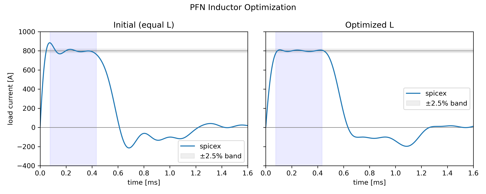

# PFN Inductor Optimization

Philip Mocz (2026)

Optimize the inductor distribution of a 5-section PFN to maximize pulse flatness,
using automatic differentiation through the transient circuit simulation.


## Circuit

```
 n1+--[ L1 ]--+n2--[ L2 ]--+n3--[ L3 ]--+n4--[ L4 ]--+n5--[ L5 ]--+n6
   |          |            |            |            |            |
   |        [ C1 ]       [ C2 ]       [ C3 ]       [ C4 ]       [ C5 ]
   |          |            |            |            |            |
 [ R_load ]   +n7          +n8          +n9          +n10         +n11
   |          |            |            |            |            |
   |      [ R_esr ]    [ R_esr ]    [ R_esr ]    [ R_esr ]    [ R_esr ]
   |          |            |            |            |            |
 n0+----------+------------+------------+------------+------------+
```


Same topology as `examples/pfn_type_b`, but all five capacitors are equal
(C = 390 µF each) and the five inductor values are the free parameters.
The load (100 mΩ) connects at the left output terminal.

All capacitors are pre-charged to V0; all inductor currents are zero at t = 0.


## Usage

```console
python pfn_optimize.py [--plot]
```


## Optimization

The inductor values are parameterized via a log-softmax so that all L_k > 0
and sum(L_k) = L_total (pulse duration is preserved):

```
L_k = L_total * softmax(w)_k
```

The loss function is the normalized RMS deviation of the load current from
I_target over the flat-top window (15%–85% of the pulse duration):

```
loss = sum_t[ mask(t) * (I(t) - I_target)^2 ] / (N_flat * I_target^2)
```

Gradients are computed with JAX automatic differentiation through the full
transient simulation, and weights are updated with `spicex.optimize()`.


## Result


