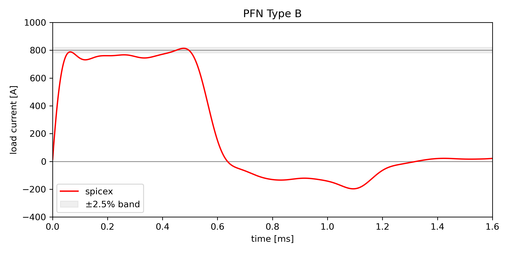

# PFN Type B

Philip Mocz (2026)

Transient simulation of a Type B Pulse-Forming Network (PFN) discharge


## Circuit

```
 n1+---[ L1 ]---+n2---[ L2 ]---+n3---[ L3 ]---+n4---[ L4 ]---+n5---[ L5 ]---+n6
   |            |              |              |              |              |
   |          [ C1 ]         [ C2 ]         [ C3 ]         [ C4 ]         [ C5 ]
   |            |              |              |              |              |
 [ R_load ]     +n7            +n8            +n9            +n10           +n11
   |            |              |              |              |              |
   |        [ R_esr ]      [ R_esr ]      [ R_esr ]      [ R_esr ]      [ R_esr ]
   |            |              |              |              |              |
 n0+------------+--------------+--------------+--------------+--------------+
```


Five series inductors along the top rail; five shunt capacitor + ESR branches.
The load (100 mΩ) connects at the left output terminal.

All capacitors are pre-charged to V0; all inductor currents are zero at t = 0.


## Usage

```console
python pfn_type_b.py [--plot]
```


## Transient Analysis

When the switch closes at t = 0, the PFN discharges into R_load.
The Thevenin equivalent of the network presents V_th = V0/2 and Z_th = Z0,
so the flat-top load current is approximately:

```
I_flat = V0 / (Z0 + R_load)
```

The non-uniform L and C values shape the current pulse to be flat
within ±2.5% over the central portion of the pulse duration.


## Result




## Reference

https://blog.wolfram.com/2022/05/06/building-a-pulse-forming-network-with-the-wolfram-language/
