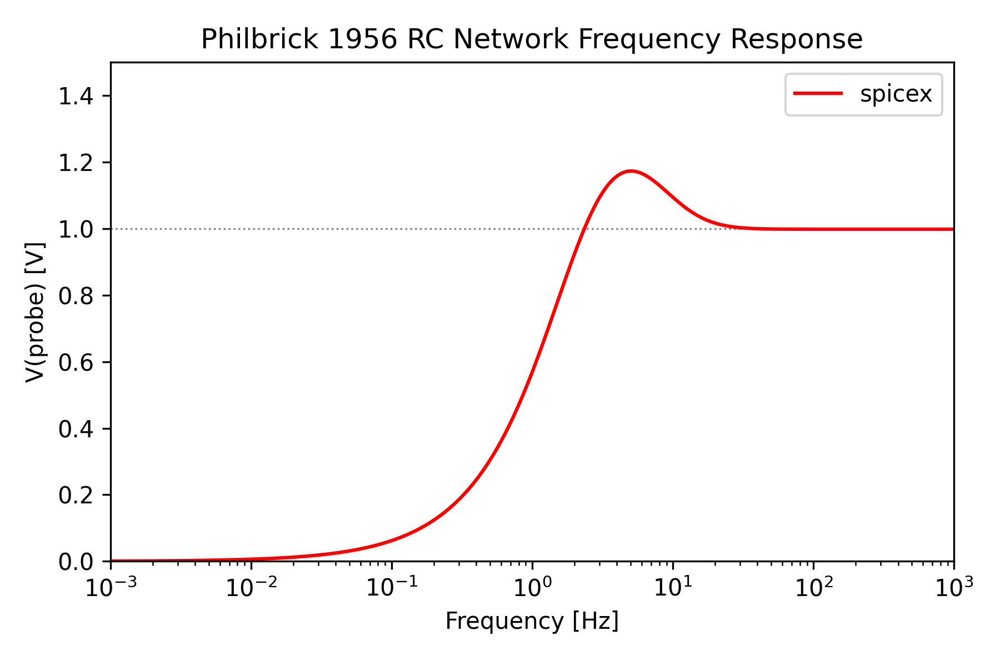

# Philbrick 1956 RC Network

Philip Mocz (2026)

AC frequency response of the three-resistor, three-capacitor RC network
patented by Philbrick in 1956.


## Circuit

```
 n1+--[ RSRC=1k ]--+n2---[ C1=10nF ]-----------------+n3 (probe V)
   |                |                                 |
 [VSRC=1V]          |--[ C2=20nF ]---+n4            [R2=3.3Meg]
   |                |                 |               |
   |                +--[ C3=50nF ]---+n5    n4+--[R3=1.0Meg]--+n5
   |                                               |
 n0+------------------------------------------[R4=510k]
                                                   |
                                          n3+---[RLOAD=100Meg]
                                                   |
 n0+-----------------------------------------------+
```

Node 2 (the RSRC/C1/C2/C3 bus) reaches the R2-R3-R4 ladder and probe node
n3 only through capacitors, so the network has no DC path: gain -> 0 as
f -> 0. At high frequency the capacitors short the ladder onto the bus
and, since RLOAD >> RSRC, gain -> 1. In between, the three-section CR
ladder produces a resonance-like peak above unity.


## Usage

```console
python philbrick_1956.py [--plot]
```


## Parameters

| Symbol | Value |
|--------|-------|
| RSRC | 1 kΩ |
| C1 | 10 nF |
| C2 | 20 nF |
| C3 | 50 nF |
| R2 | 3.3 MΩ |
| R3 | 1.0 MΩ |
| R4 | 510 kΩ |
| RLOAD | 100 MΩ |

## AC Analysis

`Circuit.solve_ac(omega)` performs a phasor (sinusoidal steady-state)
solve at each angular frequency, folding capacitors and inductors
directly into the admittance matrix (`Y_C = jωC`). The frequency sweep
uses `spicex.sweep`, which `jax.vmap`s the per-frequency solve over a
log-spaced array of 601 points from 1 mHz to 1 kHz (six decades).

## Result

For a 1 V input, the simulated gain peaks at **1.17 V near 5.0 Hz**, and
exceeds unity for roughly **2.4 Hz to 37 Hz**, closely matching the shape
described for this circuit (peak ≈ 1.19 V at ≈ 4.64 Hz, gain > 1 for
≈ 2-20 Hz) — the small numeric difference is expected since the
component values are rounded to two significant figures.


